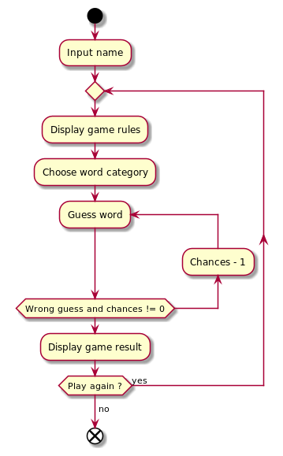
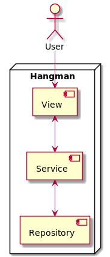

# Hangman


Hangman is a word guessing game with as many chances as a certain number. The background of making this game is a
college assignment. This game uses terminal media in using it.

## Getting Started

### Run Program

1. Start with cloning this repo on your local machine :

```
$ git clone https://github.com/aryahmph/hangman
$ cd hangman
```

2. Install Java, the latest version is better.

3. Run distribution file

```
$ java -jar target/hangman-1.0-SNAPSHOT-jar-with-dependencies.jar
```

3. Have fun playing the game!

### How it works ?

#### Activity Diagram



#### Architecture

I use the concept of a clean architecture by separating the logic of the program and the appearance of the program.


